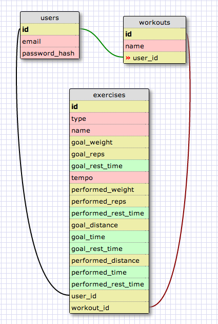

### SCHEMA



### XML
```XML
<?xml version="1.0" encoding="utf-8" ?>
<!-- SQL XML created by WWW SQL Designer, http://code.google.com/p/wwwsqldesigner/ -->
<!-- Active URL: https://socrates.devbootcamp.com/sql -->
<sql>
<datatypes db="mysql">
  <group label="Numeric" color="rgb(238,238,170)">
    <type label="Integer" length="0" sql="INTEGER" re="INT" quote=""/>
    <type label="Decimal" length="1" sql="DECIMAL" re="DEC" quote=""/>
    <type label="Single precision" length="0" sql="FLOAT" quote=""/>
    <type label="Double precision" length="0" sql="DOUBLE" re="DOUBLE" quote=""/>
  </group>

  <group label="Character" color="rgb(255,200,200)">
    <type label="Char" length="1" sql="CHAR" quote="'"/>
    <type label="Varchar" length="1" sql="VARCHAR" quote="'"/>
    <type label="Text" length="0" sql="MEDIUMTEXT" re="TEXT" quote="'"/>
    <type label="Binary" length="1" sql="BINARY" quote="'"/>
    <type label="Varbinary" length="1" sql="VARBINARY" quote="'"/>
    <type label="BLOB" length="0" sql="BLOB" re="BLOB" quote="'"/>
  </group>

  <group label="Date &amp; Time" color="rgb(200,255,200)">
    <type label="Date" length="0" sql="DATE" quote="'"/>
    <type label="Time" length="0" sql="TIME" quote="'"/>
    <type label="Datetime" length="0" sql="DATETIME" quote="'"/>
    <type label="Year" length="0" sql="YEAR" quote=""/>
    <type label="Timestamp" length="0" sql="TIMESTAMP" quote="'"/>
  </group>

  <group label="Miscellaneous" color="rgb(200,200,255)">
    <type label="ENUM" length="1" sql="ENUM" quote=""/>
    <type label="SET" length="1" sql="SET" quote=""/>
    <type label="Bit" length="0" sql="bit" quote=""/>
  </group>
</datatypes><table x="56" y="650" name="users">
<row name="id" null="1" autoincrement="1">
<datatype>INTEGER</datatype>
<default>NULL</default></row>
<row name="email" null="1" autoincrement="0">
<datatype>MEDIUMTEXT</datatype>
<default>NULL</default></row>
<row name="password_hash" null="1" autoincrement="0">
<datatype>MEDIUMTEXT</datatype>
<default>NULL</default></row>
<key type="PRIMARY" name="">
<part>id</part>
</key>
</table>
<table x="237" y="650" name="workouts">
<row name="id" null="1" autoincrement="1">
<datatype>INTEGER</datatype>
<default>NULL</default></row>
<row name="name" null="1" autoincrement="0">
<datatype>MEDIUMTEXT</datatype>
<default>NULL</default></row>
<row name="user_id" null="1" autoincrement="0">
<datatype>INTEGER</datatype>
<default>NULL</default><relation table="users" row="id" />
</row>
<key type="PRIMARY" name="">
<part>id</part>
</key>
</table>
<table x="67" y="323" name="exercises">
<row name="id" null="1" autoincrement="1">
<datatype>INTEGER</datatype>
<default>NULL</default></row>
<row name="workout_type" null="1" autoincrement="0">
<datatype>MEDIUMTEXT</datatype>
<default>NULL</default></row>
<row name="name" null="1" autoincrement="0">
<datatype>MEDIUMTEXT</datatype>
<default>NULL</default></row>
<row name="weight" null="1" autoincrement="0">
<datatype>INTEGER</datatype>
<default>NULL</default></row>
<row name="reps" null="1" autoincrement="0">
<datatype>INTEGER</datatype>
<default>NULL</default></row>
<row name="rest_time" null="1" autoincrement="0">
<datatype>TIME</datatype>
<default>NULL</default></row>
<row name="tempo" null="1" autoincrement="0">
<datatype>MEDIUMTEXT</datatype>
<default>NULL</default></row>
<row name="distance" null="1" autoincrement="0">
<datatype>INTEGER</datatype>
<default>NULL</default></row>
<row name="running_time" null="1" autoincrement="0">
<datatype>MEDIUMTEXT</datatype>
<default>NULL</default></row>
<row name="user_id" null="1" autoincrement="0">
<datatype>INTEGER</datatype>
<default>NULL</default><relation table="users" row="id" />
</row>
<row name="workout_id" null="1" autoincrement="0">
<datatype>INTEGER</datatype>
<default>NULL</default><relation table="workouts" row="id" />
</row>
<key type="PRIMARY" name="">
<part>id</part>
</key>
</table>
<table x="411" y="570" name="workout_histories">
<row name="id" null="1" autoincrement="1">
<datatype>INTEGER</datatype>
<default>NULL</default><relation table="workouts" row="id" />
</row>
<row name="workout_id" null="1" autoincrement="0">
<datatype>INTEGER</datatype>
<default>NULL</default></row>
<key type="PRIMARY" name="">
<part>id</part>
</key>
</table>
<table x="277" y="323" name="exercise_histories">
<row name="id" null="1" autoincrement="1">
<datatype>INTEGER</datatype>
<default>NULL</default></row>
<row name="weight" null="1" autoincrement="0">
<datatype>INTEGER</datatype>
<default>NULL</default></row>
<row name="reps" null="1" autoincrement="0">
<datatype>INTEGER</datatype>
<default>NULL</default></row>
<row name="rest_time" null="1" autoincrement="0">
<datatype>MEDIUMTEXT</datatype>
<default>NULL</default></row>
<row name="distance" null="1" autoincrement="0">
<datatype>DECIMAL</datatype>
<default>NULL</default></row>
<row name="running_time" null="1" autoincrement="0">
<datatype>MEDIUMTEXT</datatype>
<default>NULL</default></row>
<row name="exercise_id" null="1" autoincrement="0">
<datatype>INTEGER</datatype>
<default>NULL</default><relation table="exercises" row="id" />
</row>
<row name="user_id" null="1" autoincrement="0">
<datatype>INTEGER</datatype>
<default>NULL</default><relation table="users" row="id" />
</row>
<key type="PRIMARY" name="">
<part>id</part>
</key>
</table>
</sql>


```
